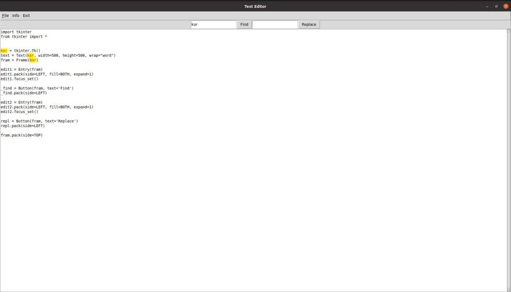

# [Text Editor](https://ru.wikipedia.org/wiki/%D0%A2%D0%B5%D0%BA%D1%81%D1%82%D0%BE%D0%B2%D1%8B%D0%B9_%D1%80%D0%B5%D0%B4%D0%B0%D0%BA%D1%82%D0%BE%D1%80)

===
__Те́кстовый реда́ктор__ — самостоятельная компьютерная программа или компонент программного комплекса (например, редактор исходного кода интегрированной среды разработки или окно ввода в браузере), предназначенная для создания и изменения текстовых данных в общем и текстовых файлов.
Для этой программы исползуется библтотека [__tkinter__](https://docs.python.org/3/library/tkinter.html). Из библиотеки [__tkinter__](https://docs.python.org/3/library/tkinter.html) импортируем модули [__askopenfile__, __asksaveasfile__, __showerror__, __messagebox__](https://docs.python.org/3/library/dialog.html#module-tkinter.filedialog)
___
Эта программа состоит из трех файлов:
- console_text_editor.py)(главный файл)
- function.py
- global_variable.py
 
__Функциональный часть:__
- Возможность редактирования файла
- Перемещение по тексту при помощи "стрелок"
- Хоткеи для сохранения и выхода

__Бонусные части:__
- Выделение текста
- Буфер обмена
- Тесктовый поиск и замена
- Перемешение курсора
- Меню и элементы интерфейса

__Нужные команды для клонирование репозитории и установки необходимых фавлов__
***
    git clone -b dev https://github.com/asliddin03/Python.git
    cd Python
    pip install -r requirements.txt

__Установка питон и допонительного пакета__
***
    sudo apt update
    sudo apt install python3.7
    sudo apt install -y python3-pip
__Переходите в папку src__
***
    cd src
__Запуск:__
***
    python3 console_text_editor.py
